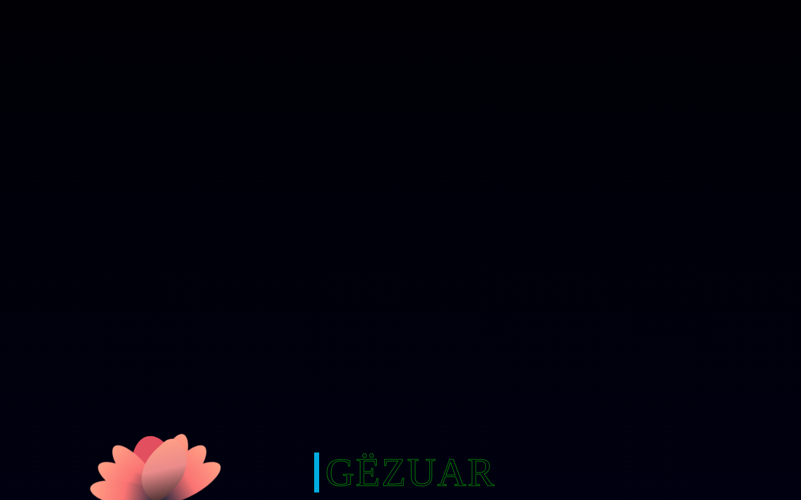

# 🌹 Dita e Trëndafilit — Animacion

Created by **Erion Nezha**

Një animacion interaktiv "Happy Rose Day" i ndërtuar vetëm me HTML, CSS dhe JavaScript:
lule e animuar që rritet dhe lulëzon, tekst me efekt neoni, kartolinë urimi që hapet,
dhe një kamerë Polaroid interaktive — kliko butonin dhe bëj një "foto"!

Teksti i dukshëm është përshtatur plotësisht në **shqip**, duke ruajtur animacionin
dhe dizajnin origjinal.

## 🎬 Demo live

👉 https://erionnezha.github.io/Rose-Day-Animation/

## 📸 Pamje



## 🚀 Si ta hapësh lokalisht

1. Shkarko ose klono këtë repozitori:
   ```bash
   git clone https://github.com/ErionNezha/Rose-Day-Animation.git
   ```
2. Hape `index.html` në shfletues — nuk kërkohet server apo ndërtim.

## 🛠️ Teknologjitë

- HTML5
- CSS3 (animacione)
- JavaScript + jQuery

## 📜 Licenca

© 2026 Erion Nezha. All rights reserved. Shih [LICENSE.txt](LICENSE.txt).

---

## English

An interactive "Happy Rose Day" animation built with pure HTML, CSS and JavaScript:
an animated flower that grows and blooms, neon glow text, an openable greeting card,
and an interactive Polaroid camera — click the button to "take a photo"!

All visible text has been localized in **Albanian**, keeping the original animation
and design.

**Live demo:** https://erionnezha.github.io/Rose-Day-Animation/

**Run locally:** open `index.html` in a browser — no server or build required.

© 2026 Erion Nezha. All rights reserved. See [LICENSE.txt](LICENSE.txt).
